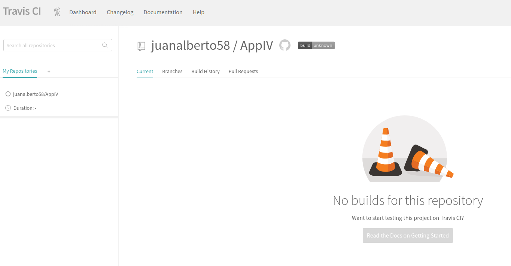
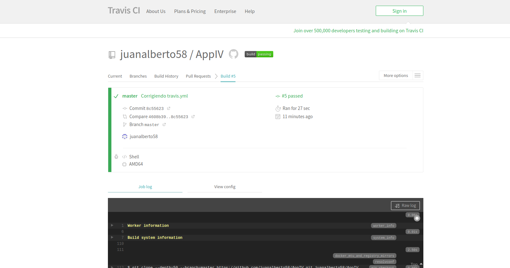

# Integración Continua

Sistemas de integración continua tenemos muchos disponibles pero nosostros para la realización de este proyecto vamos a descartar los que son de pago, tales como TeamCity, Britise ... y nos vamos a enfocar en las alternativas gratuitas como pueden ser Travis, Shippable, Jenkins, Circle CI.

Como opción principal utilizaremos Travis que más tarde hablaremos sobre su configuración. Además configuraremos alguno de los siguientes servicios gratuitos que ahora explicaremos.

## Travis

Primeramente tenemos que abrirnos una cuenta en la página de Travis, además en el proceso de creación de dicha cuenta podemos vincularla con nuestra cuenta de Github para poder ejecutar el servicio más tarde a traves de la app de Travis de Github App automaticamente.

Una vez creada, lo siguiente que debemos de hacer es el archivo de configuración, .travis.yml. Este archivo lo configuramos de la siguiente manera:

Como imagen escogeremos la **minimal**, utilizaremos esta ya que con Travis ejecutaremos la llamada al contenedor que tenemos previamente configurado con Docker con la ejecución de los test del proyecto, por lo tanto no necesitamos ninguna imagen con ningún lenguaje especifico y cogemos esta ya que disponemos de la herramienta de Docker y es la que menos dependencias innecesarias en nuestro caso tiene y en teoría mas rápida se ejecuta.

Despues de elegir la imagen lo siguiente es configurar que se va a ejecutar. En este caso lo qeu haremos será una llamada a nuestro gestor de tareas, el cual llamará a nuestro contenedor de Docker el cual ya se encargara de hacer los test oportunos.

A través de el siguiente enlace llegara al [fichero de configuración](https://github.com/juanalberto58/AppIV/blob/master/.travis.yml) de Travis.

Y como muestro en la siguiente captura de pantalla ya tenemos Travis funcionando:

## Shippable

