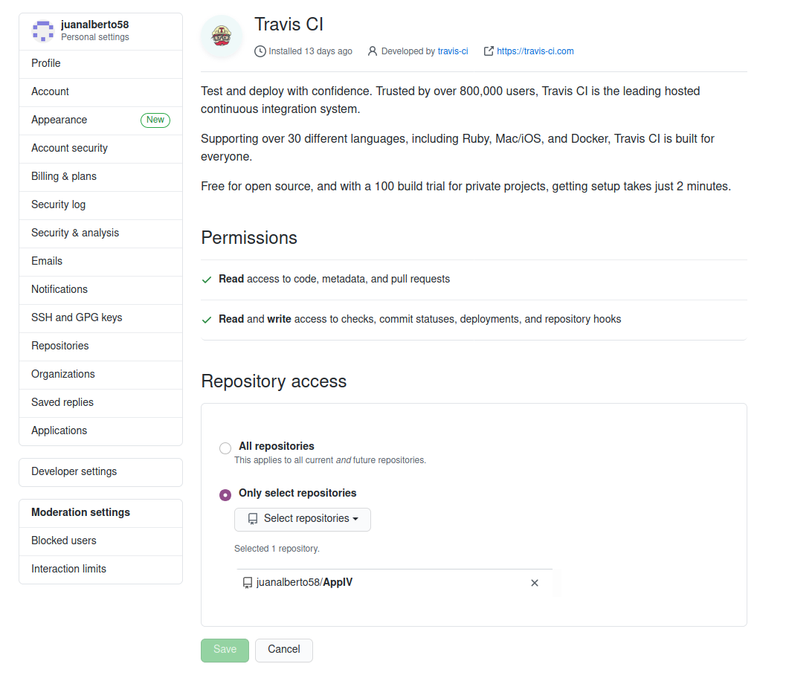
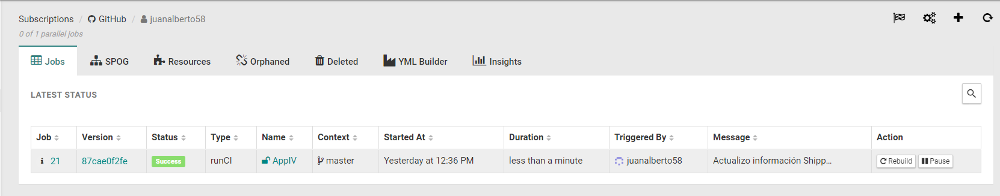

# Integración Continua

Sistemas de integración continua tenemos muchos disponibles pero nosostros para la realización de este proyecto vamos a descartar los que son de pago, tales como TeamCity, Britise ... y nos vamos a enfocar en las alternativas gratuitas como pueden ser Travis, Shippable, Jenkins, Circle CI.

Como opción principal utilizaremos Travis que más tarde hablaremos sobre su configuración. Además configuraremos alguno de los siguientes servicios gratuitos que ahora explicaremos.

## Travis

Primeramente tenemos que abrirnos una cuenta en la página de Travis, además en el proceso de creación de dicha cuenta podemos vincularla con nuestra cuenta de Github para poder ejecutar el servicio más tarde a través de la app de Travis de Github App automáticamente.

Una vez creada la cuenta tenemos que habilitar el repositorio en el que queramos que se aplique la integración continua. En nuestra cuenta de Github en la parte de ajustes, tenemos el apartado de integración en el cual podremos especificarle si queremos que la integración se active para todos los repositorios o si solo queremos activarla para ciertos repositorios unicamente:

Una vez hecho los pasos anteriores, lo siguiente que debemos de hacer es el archivo de configuración, [.travis.yml.](https://github.com/juanalberto58/AppIV/blob/master/.travis.yml). Este archivo lo configuramos de la siguiente manera:

Como lenguaje escogeremos **minimal**, utilizaremos este ya que con Travis ejecutaremos la llamada al contenedor que tenemos previamente configurado con Docker con la ejecución de los test del proyecto, por lo tanto no necesitaremos ningún lenguaje especifico y cogeremos este ya que disponemos de la herramienta de Docker y es el que menos dependencias innecesarias en nuestro caso tiene y en teoría mas rápido se ejecuta.

Despues de elegir el lenguaje lo siguiente es configurar que se va a ejecutar. En este caso lo que haremos será una llamada a nuestro contenedor de Docker el cual ya se encargara de hacer los test oportunos.

Y como muestro en la siguiente captura de pantalla ya tenemos Travis funcionando:

## Shippable

Para empezar a configurar este servicio tenemos que proceder como con Travis, entramos en su página y nos abrimos una cuenta, durante el proceso podremos vincular dicha cuenta con nuestra cuenta de Github.

Seguimos los pasos que nos indican, le damos autorización de nuestro datos y algunos permisos que se nos requiere y ya tendriamos nuestra cuenta de Github vinculada. (No tengo capturas para mostrar estos pasos debido a que este proceso lo realice ya y no puedo volver a repetirlo pero es simplemen seguir los pasos que nos indican desde shippable)

Una vez creada y vinculada con Github tenemos que sincronizar con el repositorio de Github que queramos y habilitar su acceso. 

Una vez habilitado nuestro repositorio el siguiente paso es hacer el archivo de configuración, shippable.yml, el cual es muy similar al archivo de configuración de travis, su configuración será la siguiente:

De igual manera que en el de Travis tenemos que seleccionar un lenguaje, en este caso el lenguaje será **Go** ya que al contrario que Travis, este no reconoce **minimal**. lo siguiente que tenemos que decirle en el fichero de configuración es la versión del lenguaje, que en mi caso será la **1.15**. Una vez seleccionado el lenguaje y su versión, lo siguiente será hacer una llamada a nuestro gestor de tareas, el cual llamará a nuestro contenedor que se encargará de hacer los test.

A través del siguiente enlace llegará al [fichero de configuración](https://github.com/juanalberto58/AppIV/blob/master/.shippable.yml) de shippable

Y una vez realizados todos los anteriores pasos ya tenemos shippable funcionando como muestro en la siguiente captura de pantalla:

