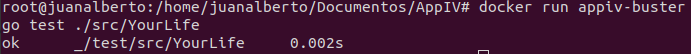
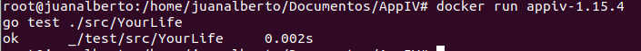
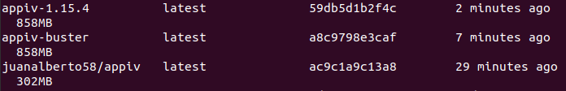
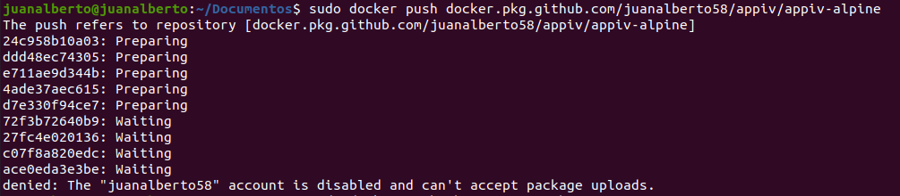
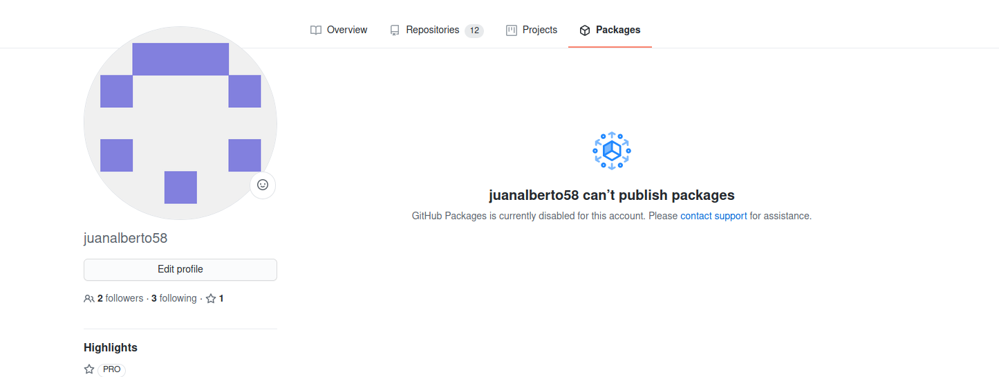
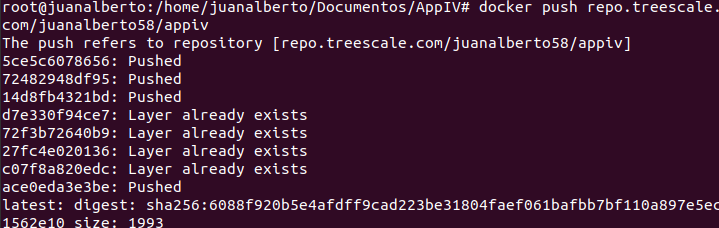
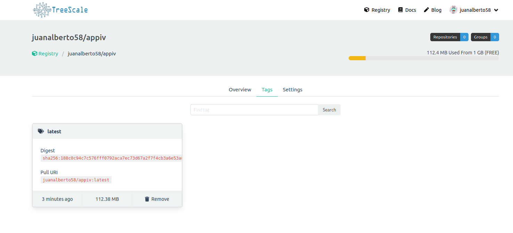

# Docker

## Contenedor Base
La elección del contenedor base es la que nos ofrece Golnag en su verión 1.15 y además la imagen utilizada será **alpine3.12** por los motivos que se explicarán a continuación. 

Esta imagen nos ofrece un tamaño muy inferior al resto de imágenes(103.29MB), lo que hará que la ejecución y la construcción sea mucho mas rápida que en el resto de las imágenes. Como únicamente la utilizaremos para realizar test que no requieren de mucho peso computacional, nos conviene que cuanto menos ocupe, mejor.

Además la velocidad de construcción en comparación con el resto de las imágenes testeadas es mejor (La realización de los test en este caso tarda 0,001s).

El resto de alternativas probadas son:
- **1.15-buster** : La cual pesa 283.1MB, tarda más en construirse y además tarda más en ejecutar los test.

- **1.15.4** : La cual pesa también 283.1MB y me daba el mismo error que la de arriba.

Como podemos ver además el tamaño es menor.

Por lo tanto trás todo lo anterior me quedo con la imagen **Alpine**

## Dockerfile
La configuración de dicho fichero es la siguiente:
- **FROM golang:alpine3.12** : Elegimos el contenedor base que utilizaremos.
- **LABEL maintainer="Juan Alberto Rivera Peña"** : Añadimos una etiqueta con el nombre del creador.
- **RUN apk add --no-cache make && adduser --disabled-password juanalberto58** : Instalamos la herramienta make necesaria y además que ignore toda la caché y añadimos un usuario a la imagen descativando contraseña.
- **USER juanalberto58** : Utilizamos el usuario sin privilegios.
- **WORKDIR /test** : Asignamos el directorio en el que trabajaremos, en este caso test.
- **CMD ["make", "test"]** : Damos la orden de la ejecución de los test.

## Optimización de la imagen
Para optimizar la imagen creada he realizado varios pasos:
- Crear un archivo .dockerignore que nos elimine todos los archivos innecesarios.
- Se han minimizado el número de etiquetas RUN, COPY ya que cada instrucción aumenta el tamaño de la construcción.

Con estos dos simples pasos ya hemos aligerado la imagen, aunque la velocidad de ejecución sigue siendo la misma de 0,001s.

## Buenas Prácticas
- No ejecutamos los test con el usuario root, que es el usuario por defecto de docker ya que no es necesario que nuestros test se ejecuten con privilegios de administrador.
- Hemos creado el fichero dockerignore para borrar todos los archivos que no necesitamos. 
- Se ha hecho uso de la instrucción WORKDIR en vez de utilizar comandos como mkdir.
- Se han minimizado todas las etiquetas para minimizar el tamaño.
- Se han añadido metadatos en el proyecto que puedan servir para dar información.
- Se ha tratado de hacer la instrucción RUN más legible dividiendo en saltos de línea los comandos a ejecutar.

## Github Container Registry -- Treescale
Trás realizar toda la serie de procesos y pasos para enlazar el container de docker con github se me han presentado el siguiente problema:

Y parece ser que mi cuenta de Github tiene Github Packages desactivado:

Debido a esto he tenido que buscar un Container Registry alternativo y el elegido es Treescale.com. Trás crear mi repositorio en treescale el proceso para subir el contenedor es el siguiente:

Donde el enlace a mi repositorio es el [siguiente](https://repo.treescale.com/juanalberto58/appiv)

## Enlazando Github con DockerHub

Para enlazar Github con DockerHub primero tenemos que acceder a DockerHub, ir a nuestro repositorio creado, pulsar sobre el menú 'builds' y una vez hecho esto veremos la opción de vincular nuestra cuenta de git: 

En el momento en el que la vinculemos ya nos aparecerá la opción de poner automatizar las ejecuciones:

Además al pulsar el botón de 'Configure Automate Builds' ya lo podremos configurar, tendremos que asociar nuestro repo de DockerHub con nuestro repo de Github, decirle en que parte tenemos el fichero Dockerfile y una vez hecho esto ya tenemos el proceso completado.

