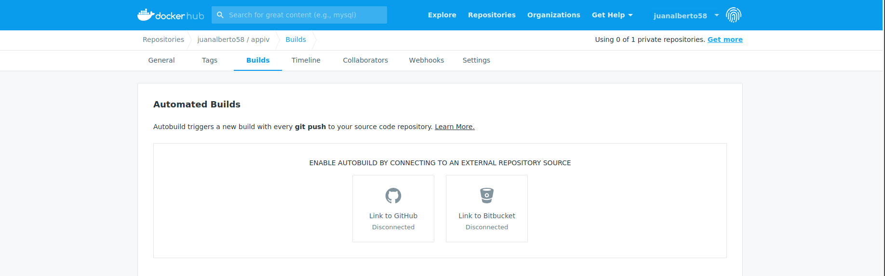
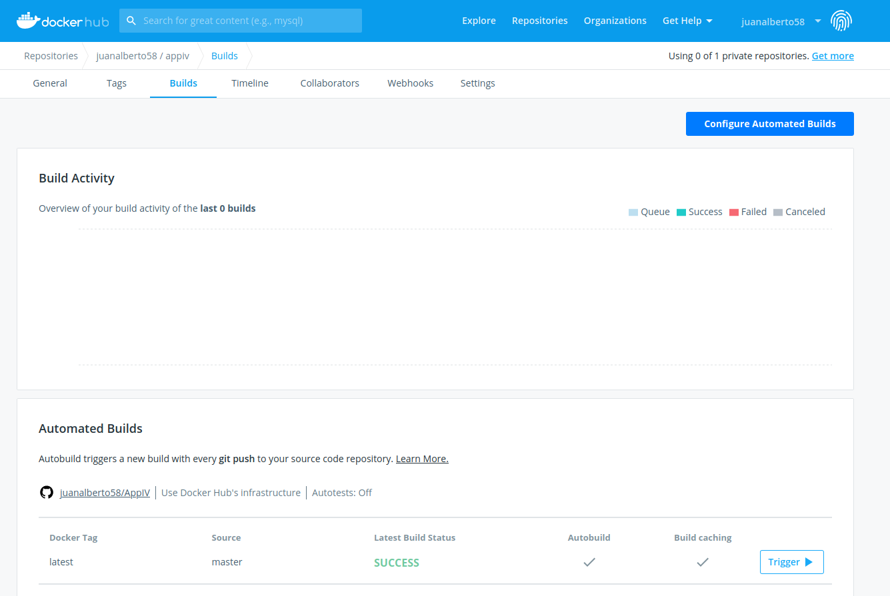
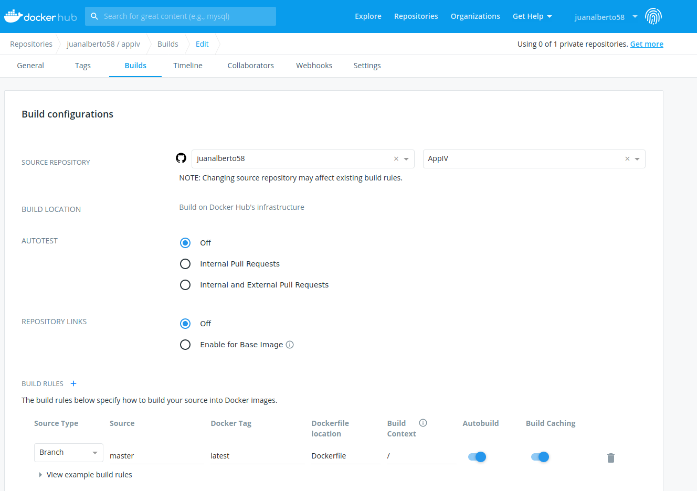

# Docker

## Contenedor Base
La elección de la base es **1.15.3-alpine3.12**. Esta imagen nos ofrece un tamaño muy inferior al resto de imágenes(103.29MB), lo que hará que la ejecución y la construcción sea mucho mas rápida que en el resto de las imágenes. Como únicamente la utilizaremos para realizar test que no requieren de mucho peso computacional, nos conviene que cuanto menos ocupe, mejor.

Además la velocidad de construcción en comparación con el resto de las imágenes testeadas es mejor (La realización de los test en este caso tarda 0,001s).

El resto de alternativas probadas son:
- **1.15-buster** : La cual pesa 283.1MB y directamente me daba errores al actualizar la imagen e instalar make, cosa que es totalmente necesaria para la realización de los test.
- **1.15.4** : La cual pesa también 283.1MB y me daba el mismo error que la de arriba.

## Dockerfile
Como podemos ver en dicho fichero, su construcción sigue unos simples pasos:
- **FROM golang:1.15.3-alpine3.12** : Elegimos el contenedor base que utilizaremos.
- **LABEL maintainer="Juan Alberto Rivera Peña"** : Añadimos una etiqueta con el nombre del creador.
- **WORKDIR /test** : Asignamos el directorio en el que trabajaremos, en este caso test.
- **COPY . .** : Copiamos los archivos necesarios para la realización de los test.
- **RUN apk update && apk add make** : Actualizamos e instalamos la herramienta make.
- **RUN adduser -D juanalberto58** : Añadimos un usuario a la imagen.
- **USER juanalberto58** : Utilizamos el usuario sin privilegios.
- **CMD ["make","test"]** : Damos la orden de la ejecución de los test.

## Enlazando Github con DockerHub

Para enlazar Github con DockerHub primero tenemos que acceder a DockerHub, ir a nuestro repositorio creado, pulsar sobre el menú 'builds' y una vez hecho esto veremos la opción de vincular nuestra cuenta de git: 

En el momento en el que la vinculemos ya nos aparecerá la opción de poner automatizar las ejecuciones:

Además al pulsar el botón de 'Configure Automate Builds' ya lo podremos configurar, tendremos que asociar nuestro repo de DockerHub con nuestro repo de Github, decirle en que parte tenemos el fichero Dockerfile y una vez hecho esto ya tenemos el proceso completado.

