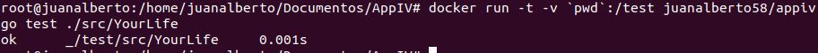
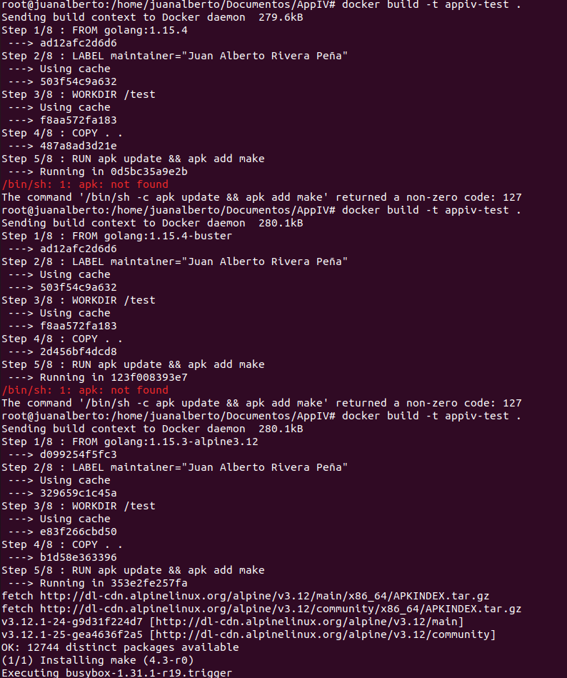

# Docker

## Contenedor Base
La elección de la base es 1.15.3-alpine3.12. Esta imagen nos ofrece un tamaño muy inferior al resto de imagenes(103.29MB), lo que hara que la ejecución y la construcción sea mucho mas rapida que en el resto de las imagenes. Como unicamente la utilizaremos para realizar test que no requieren de mucho peso computacional, nos conviene que cuanto menos ocupe, mejor.

Además la velocidad de construcción en comparación con el resto de las imagenes testeadas es mejor (La realización de los test en este caso tarda 0,001s).

El resto de alternativas probadas son:
- 1.15-buster : La cual pesa 283.1MB y directamente me daba errores al actualizar la imagen e instalar make, cosa que es totalmente necesaria para la realizacion de los test.
- 1.15.4 : La cual pesa tambien 283.1MB y me daba el mismo error que la de arriba.

## Dockerfile
Como podemos ver en dicho fichero, su contrucción sigue unos simples pasos:
- **FROM golang:1.15.3-alpine3.12** : Elegimos el contenedor base que utilizaremos.
- **LABEL maintainer="Juan Alberto Rivera Peña"** : Añadimos una etiqueta con el nombre del creador.
- **WORKDIR /test** : Asignamos el directorio en el que trabajaremos, en este caso test.
- **COPY . .** : Copiamos los archivos necesarios para la realización de los test.
- **RUN apk update && apk add make** : Actualizamos e instalamos la herramienta make.
- **RUN adduser -D juanalberto58** : Añadimos un usuario a la imagen.
- **USER juanalberto58** : Utilizamos el usuario sin privilegios.
- **CMD ["make","test"]** : Damos la orden de la ejecución de los test.

## Enlazando Github con DockerHub

