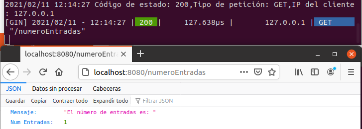

# Microservicios

## Justificación de Framework Gin-Gonic

El Microframework para la implementación del microservicio elegido es [Gin-Gonic](https://github.com/gin-gonic/gin), ya que tras hacer un estudio de las diferentes posibilidades como por ejemplo [Beego](https://beego.me/), [Martini](https://github.com/go-martini/martini) o [Revel](https://revel.github.io/), Gin nos ofrece un entorno minimalista y solo nos incluye las bibliotecas y funcionalidades esenciales necesarias para nuestro proyecto, si nuestro proyecto fuera de mayor envergadura la elección de microframework sería Revel, ya que nos ofrece una cantidad enorme de funciones y posibilidades. 

Además Gin nos ofrece una muy buena documentación y sobre todo la gran virtud de este microframework es su velocidad, ya que al estar pensado para ser lo más minimalista posible es extremadamente rápido en comparación con por ejemplo Revel o Martini, siendo hasta 40 veces más rápido que este último. 

A través de este [enlace](https://github.com/gin-gonic/gin#benchmarks) podrás ver los Benchmark de algunos de los Microframeworks citados anteriormente.

## Diseño general de la Api e Historias de Usuario

En la Api se han desarrollado las siguientes HU en el archivo [main.go](https://github.com/juanalberto58/AppIV/blob/master/src/main.go) en el cual se utiliza el archivo [api.go](https://github.com/juanalberto58/AppIV/blob/master/src/m/api.go) el cual tiene el código necesario para realizar las funciones internas de manera que realicen las distintas acciones, además **main.go** tiene sus respectivos test en el archivo [main_test](https://github.com/juanalberto58/AppIV/blob/master/src/main_test.go) que los ejecuto importando el paquete httptest de GO que nos proporciona todas las herramientas necesarias para realizar los test de servidor diciéndonos si las rutas y lo que estas ejecutan al recibir la petición nos devuelve el resultado correcto. La **api.go** también tiene sus respectivos test, pero esta vez solo importamos el paquete **testing** de Go con el cual realizamos los test automatizados, estos se encuentran en el archivo [api_test.go](https://github.com/juanalberto58/AppIV/blob/master/src/m/api_test.go).

Cada HU implementada tiene su respectiva ruta diferente dentro de la app, las HU implementadas son las siguientes:

- **HU1: El usuario podrá añadir una nueva entrada al diario.**
	- Esta HU se desarrolla con la función introducirEntrada(), en ella se procesan y se envían los datos de una entrada mediante una petición POST y su ruta es /anadeEntrada.
	
- **HU2: El usuario podra editar la entrada del diario.**
	- Una vez introducida la entrada mediante la función editarEntrada() podemos editar la entrada enviada. Además esta se realiza también con una petición POST y su ruta es /modificarEntrada.
	
- **HU4: El usuario podrá ver el número de entradas del diario.**
	- Esta HU se implementa en la función obtenerNumEntradas(), esta se obtiene mediante una petición GET y su ruta es /numeroEntradas.
	
- **HU6: El usuario podrá consultar una entrada del diario.**
	- Se implementa en obtenerEntrada() la cual obtenemos con una petición GET y su ruta es /obtenerEntrada.
	

## Uso de buenas prácticas, middleware y log

En cuanto al uso de buenas prácticas he dividido el código entre una clase manejadora que controla la funcionalidad de la aplicación internamente [api](https://github.com/juanalberto58/AppIV/blob/master/src/m/api.go) y la clase que realiza las llamadas las peticiones al servidor [main](https://github.com/juanalberto58/AppIV/blob/master/src/main.go).

Además he implementado un middleware que funcione de logs personalizado para que muestre diferentes datos antes de la activación de las rutas como pueden ser la Ip del cliente de la petición, el tipo de petición y el código de estado de esta. Como se puede apreciar en la captura siguiente el middleware funciona correctamente ya que nos muestra los mismos parámetros que el de log por defecto:

El log implementado está en el archivo [main.go](https://github.com/juanalberto58/AppIV/blob/master/src/main.go), la función LogMid y es llamado antes de la activación de las rutas.

## Test

En cuanto a los test como he mencionado anteriormente cada archivo tanto el main como la api tiene sus respectivos test.

La api tiene su archivo test llamado [api_test.go](https://github.com/juanalberto58/AppIV/blob/master/src/m/api_test.go) en el cual se realizan los test correspondientes y el archivo main tambien tiene sus test en el archivo [main_test](https://github.com/juanalberto58/AppIV/blob/master/src/main_test.go) correspondientes enfocados en comprobar si las peticiones que se realizan devuelven el resultado correcto, además también cada función de test está enfocada en cada HU para comprobar que el trabajo realizado es el correcto.

