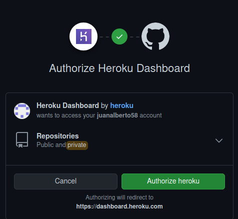
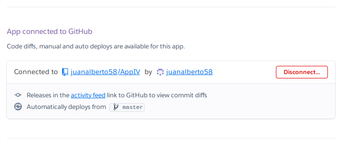
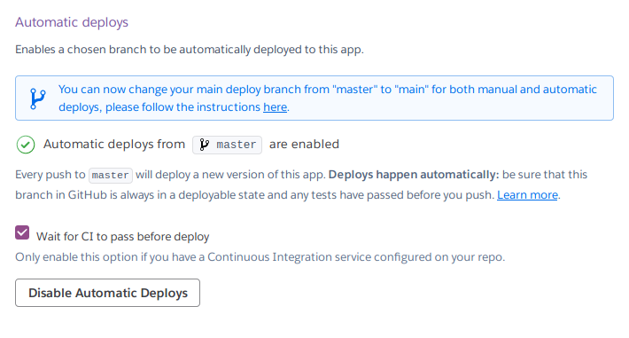
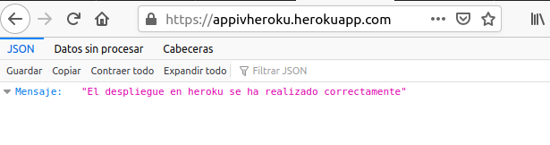
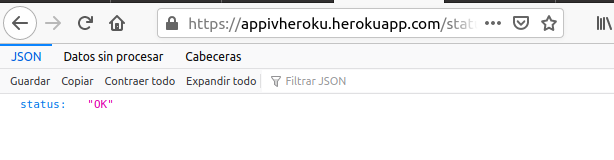
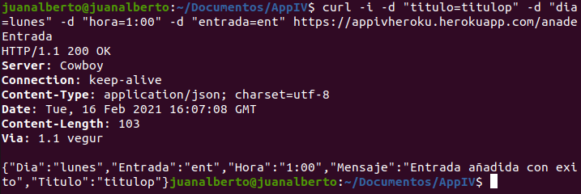
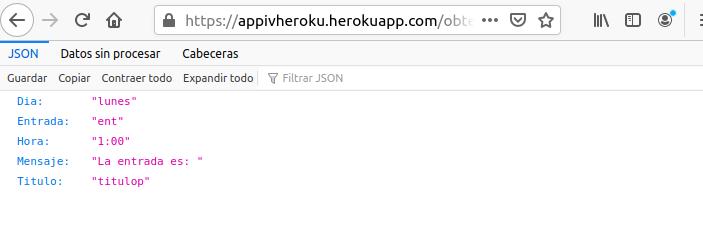
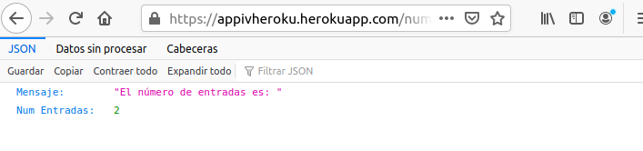
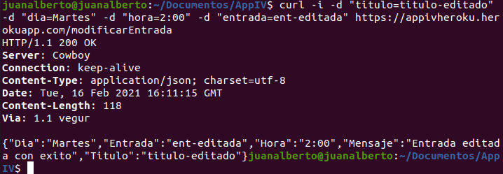
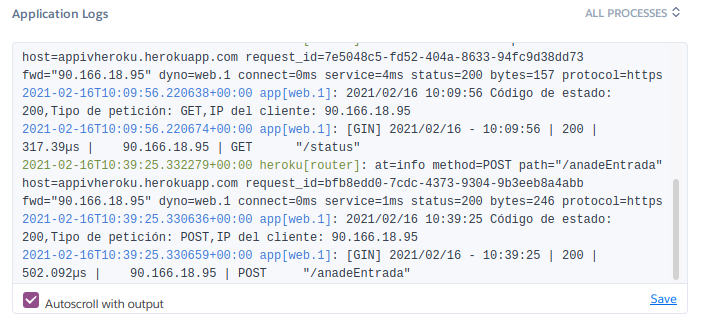

# PaaS

## Descripción y justificación para desplegar en un PaaS

La plataforma que usaremos será Heroku, ¿Por que Heroku?, lo primero es porque ya lo he utilizado en otras ocasiones, lo conozco y se cuales son las funcionalidades que nos ofrece, además de soportar aplicaciones en el lenguaje Go.

Heroku nos ofrece una documentación excelente y su utilización para arrancar nuestra aplicación es sencilla además de ofrecernos la posibilidad de ser gratuito el proceso. En Heroku podemos instalar addons para utilizar funcionalidades nuevas, tiene un sistema de log bastante bueno, sobre todo nos permite escalar nuestra aplicación si fuera necesario.

## Descripción de la configuración

Lo primero que hay que hacer es registrarse y abrir una cuenta en Heroku, una vez hemos creado nuestra cuenta lo siguiente es ir a crear un nueva app, añadimos el nombre que queramos que tenga nuestra app, en mi caso 'appivheroku' y Europa de región.

Lo siguiente que vamos a hacer es irnos al menú Deploy y vamos a vincular nuestra app de heruko con nuestro repo de github:

Buscamos nuestro repo y lo conectamos, una vez hecho esto ya tenemos nuestro repo conectado con nuestra app de heroku:

Además como podemos ver en la siguiente captura lo hemos configurado para que con cada push en nuestro repo de github si se pasan todos los test de integración continua configurados previamente se haga un despligue automático:

Una vez hecho esto, el siguiente paso es realizar el archivo de configuración de Heroku en nuestra aplicación para que Heroku sepa que acción tiene que realizar. Este archivo se llama [Procfile](https://github.com/juanalberto58/AppIV/blob/master/Procfile) y lo utiliza Heroku para arrancar la aplicación, en mi caso en este archivo habrá una llamada a una acción en mi [task-runner](https://github.com/juanalberto58/AppIV/blob/master/makefile) que iniciara el proceso.

Una vez hecho todos los pasos anteriores ya tenemos nuestra aplicación desplegada. El enlace a mi aplicación es el siguiente:

[https://appivheroku.herokuapp.com/](https://appivheroku.herokuapp.com/)

## Rutas y funcionamiento

- / : Nos devuelve que el servicio esta funcionando:

- /status :	Con la ruta /status comprobamos que efectivamente el servicio esta funcionando:

- /anadeEntrada : Esta ruta hace referencia a la HU1, con la cual añadimos una entrada al sistema, como podemos comprobar en la siguiente captura funciona correctamente:

- /obtenerEntrada : Con esta ruta que hace referencia a la HU6 obtenemos la entrada añadida:

- /numeroEntradas : Esta ruta hace referencia a la HU4 y nos devuelve el numero de entradas añadidas: 

- /editarEntrada : En esta ruta, referente a la HU2 podemos editar una entrada del sistema:

## Logs

En cuanto al sistema de logs no he tenido que implementar nada ya que Heroku nos ofrece por defecto un sistema de logs en su dashboard y este nos permite ver el funcionamiento de la aplicación:

