# Serverless

## Vercel

Lo primero que tenemos que hacer es ir a la página de [Vercel](https://vercel.com/), una vez dentro vamos a registrarnos y trás esto nos saldrá la opción de seguir con nuestra cuenta de Github:

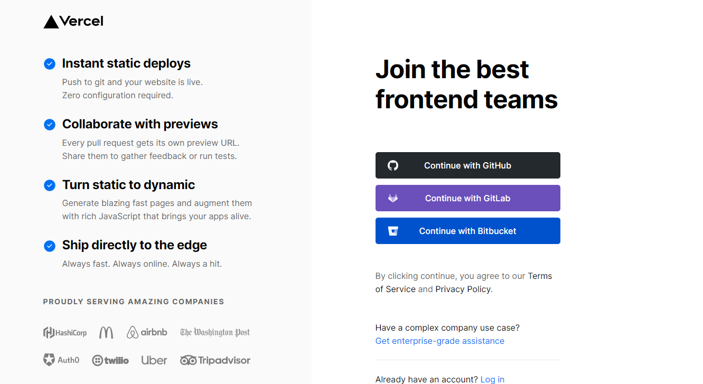

Le damos permisos: 

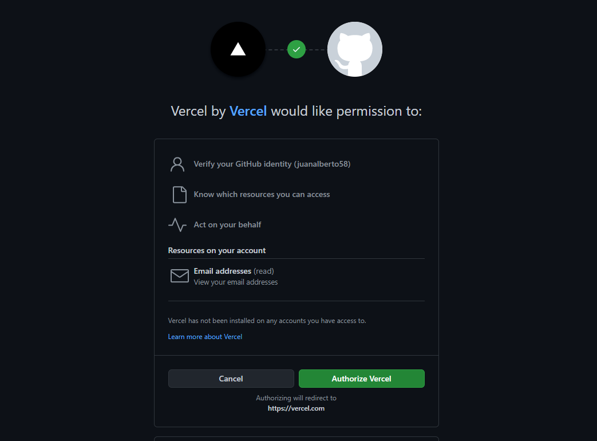

Una vez dentro nos pide importar repositorio de Github o importar template, en nuestro caso vamos a importar nuestro repositorio de Github que es con el que estamos trabajando:

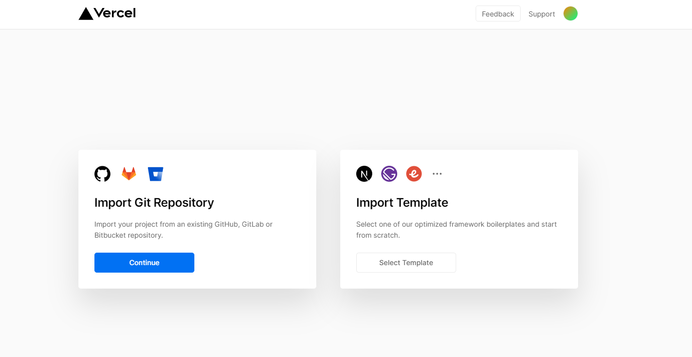
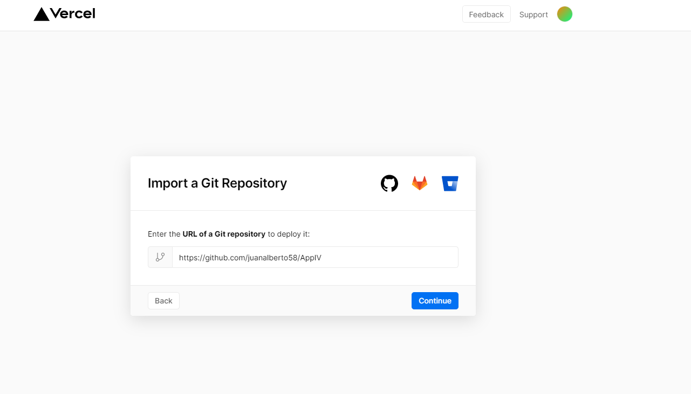

Tras esto nos pregunta si queremos que con cada push que hagamos en nuestro repositorio haga un despliegue a lo que le decimos que si:

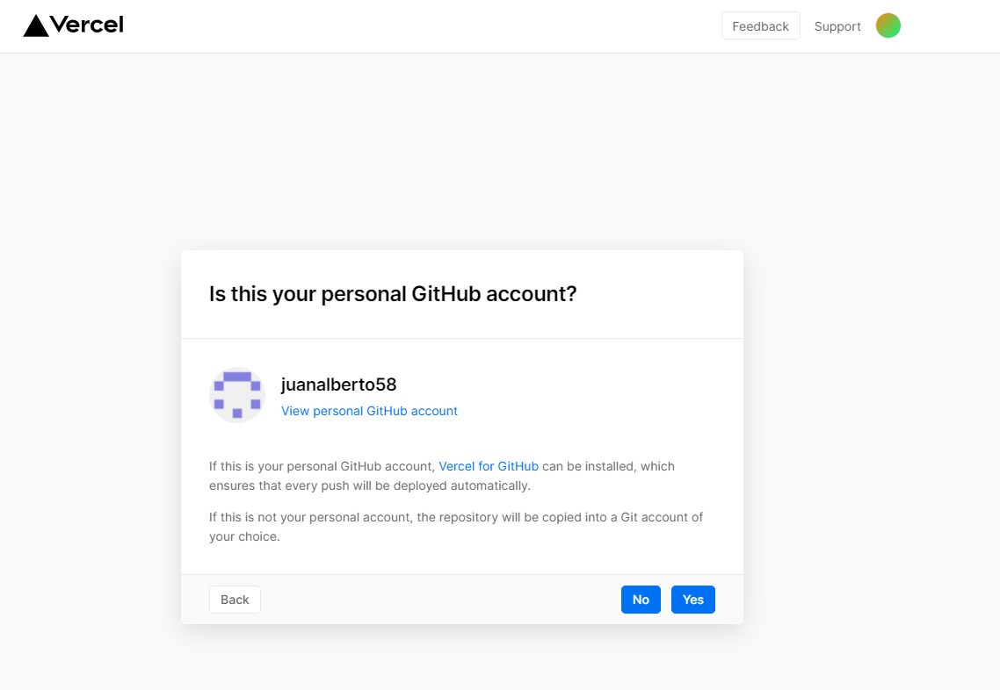

Despues de seleccionar 'Si' empezamos con la instalación de vercel en nuestro repositorio de Github:

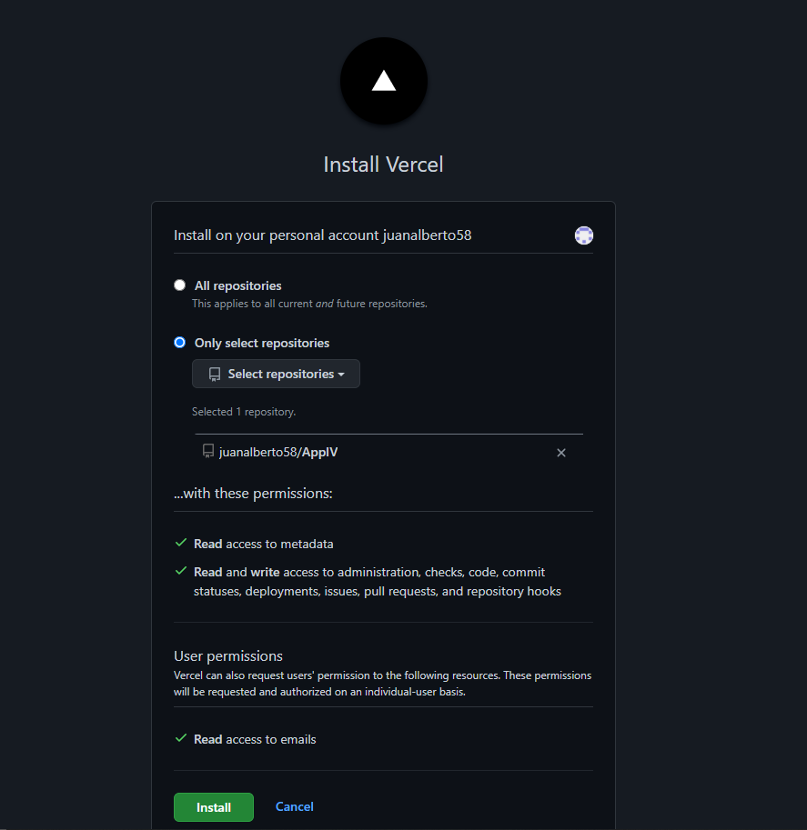

Importamos nuestro proyecto:

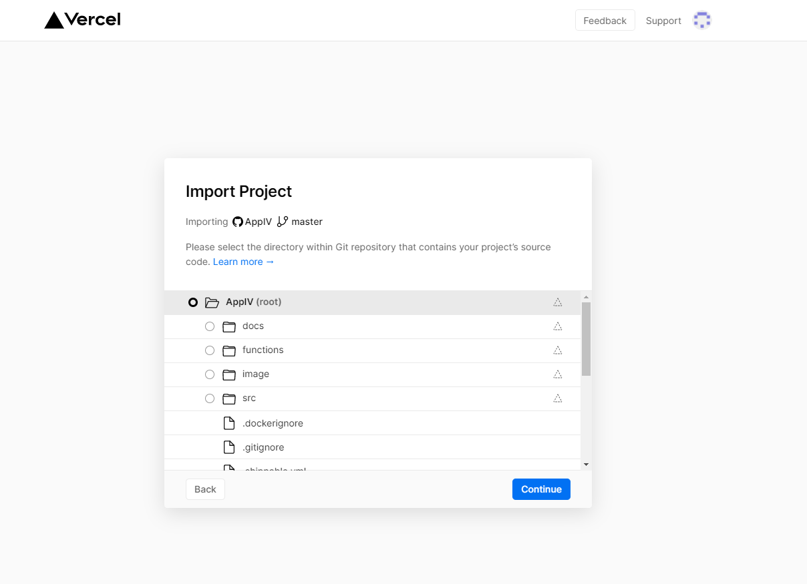

Y ya tendriamos nuestro proyecto desplegado:

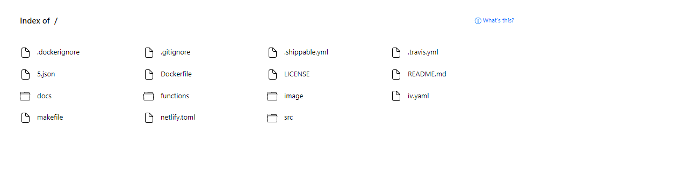

Una vez todo esto realizado vamos a implementar una [función](https://github.com/juanalberto58/AppIV/blob/master/api/diario.go). Dicha función la he programado en GO. En esta función lo que se hace es crear un formulario con HTML con el que pasandole por parámetro un dia de la semana nos mostrará el titulo del dia en el diario y si no existe o no se le pasa nada por parámetro nos mostrará un mensaje de error. Además con esta función cubrimos la siguiente [Historia de Usuario](https://github.com/juanalberto58/AppIV/issues/58) 

A través del siguiente [enlace](https://app-iv-g27e35if3.vercel.app/api/diario) podremos comprobar el correcto funcionamiento de dicha función. 

## Netlify

Para empezar lo que tenemos que hacer es ir a la página de [Netlify](https://www.netlify.com/), una vez dentro vamos a registrarnos y trás darle a registro ya nos aparace la opción de vincular con nuestra cuenta de Github.

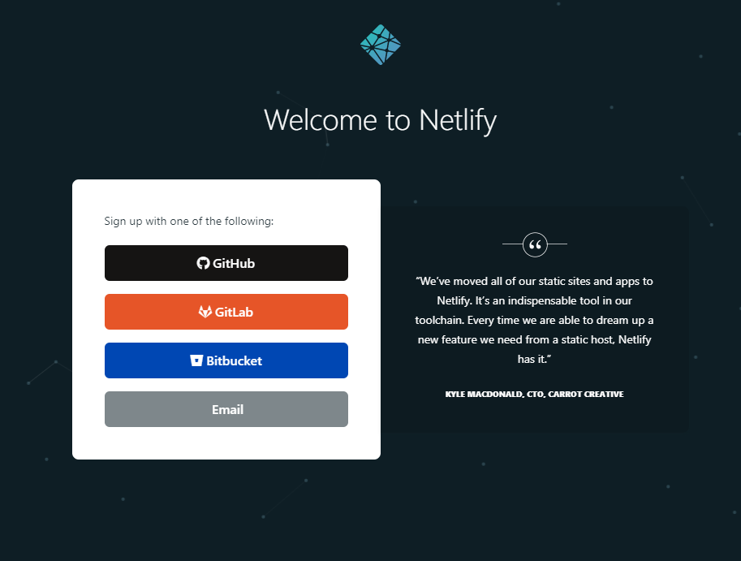

Autorizamos el acceso:

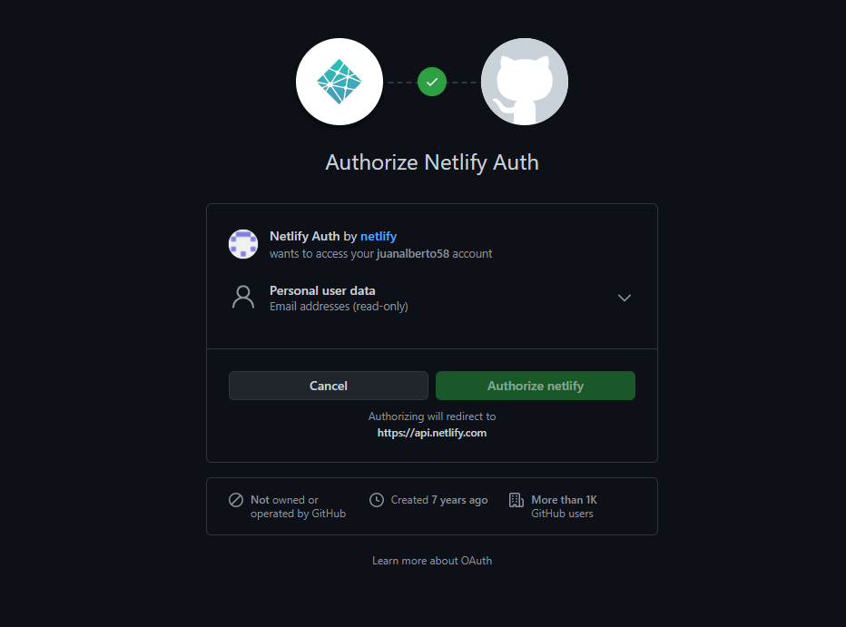

Una vez hecha nuestra cuenta de Netlify ya vinculada con Github, el siguiente paso será crear nuestro sitio en Netlify que deberá de estar enlazado con nuestro repositorio de Github.

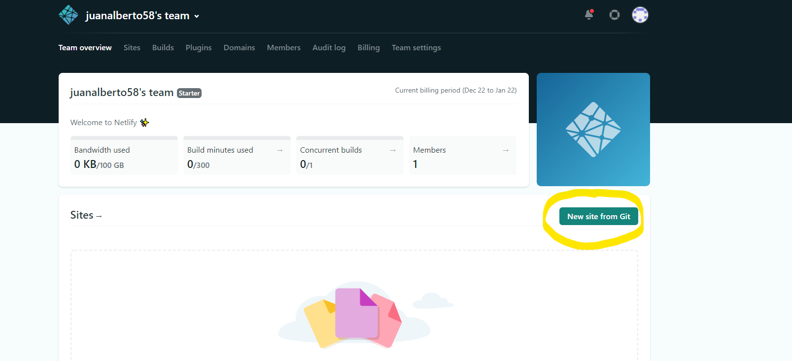

Tenemos que volver a autorizar el acceso y ya nos saltará el proceso de instalación de Netlify en el que tendremos que seleccionar nuestro repositorio de Github y posteriormente instalar: 

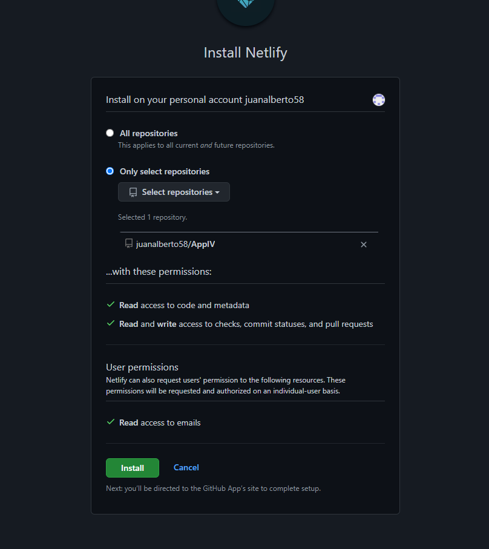

Una vez hecho todos los pasos anteriores lo que nos queda es configurar el despliegue:

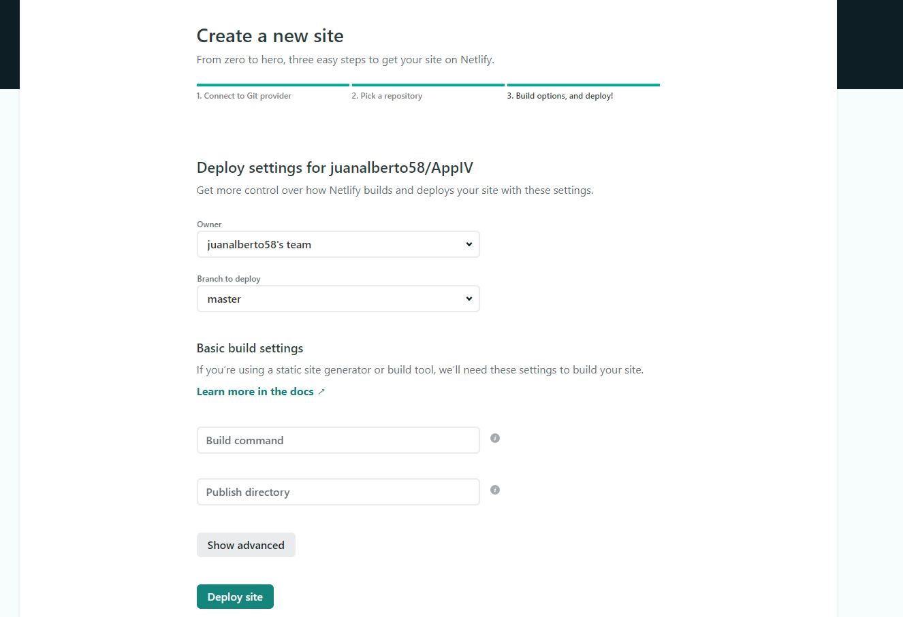

Tras realizar todos los anteriores pasos ya tenemos Netlify configurado y nos proporciona un dominio por defecto, el cual vamos a cambiar por **appiv.netlify.app**

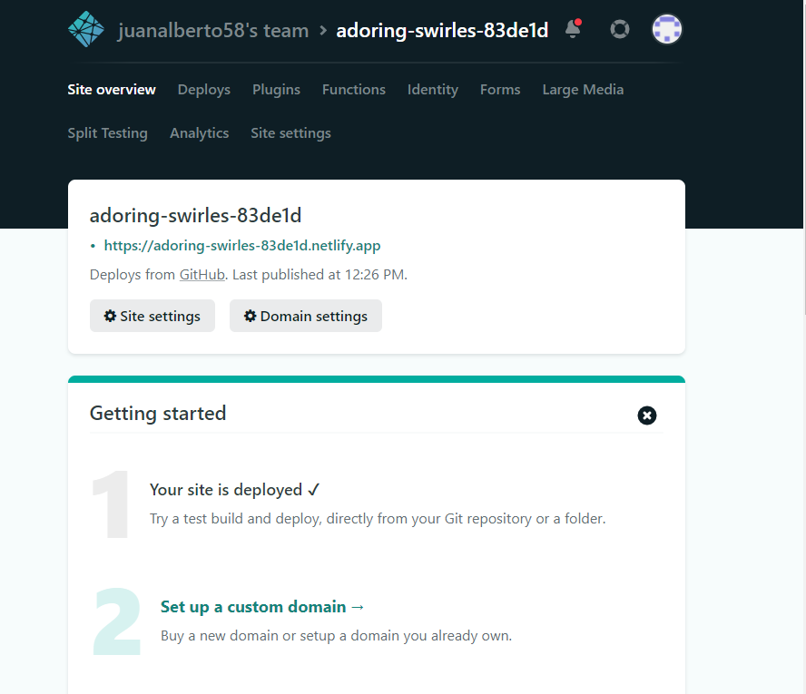
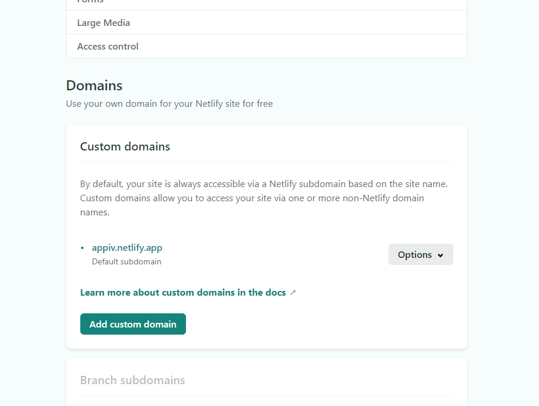

Vamos a configurar tambien los despliegues para ello que vamos a decir a Netlify que el directorio en el cual encontrará nuestros ficheros de código será **functions**:

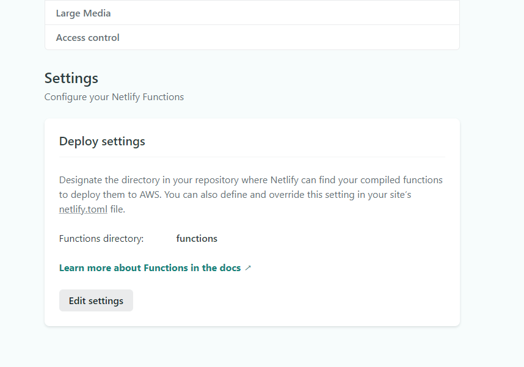

Una vez todo configurado lo siguiente es hacer la función que se implementará, dicha [función](https://github.com/juanalberto58/AppIV/blob/master/functions/diario.js) pertenece a la [historia de usuario](https://github.com/juanalberto58/AppIV/issues/32).
Como podemos ver dicha función lo que realiza es que muestra todas las entradas registradas en el diario y estas entradas se encuentran en el fichero diario.json las cuales las devuelve si todo se ha realizado correctamente.

A través del siguiente [enlace](https://appiv.netlify.app/.netlify/functions/diario) se puede ver como dicha función funciona correctamente. 
